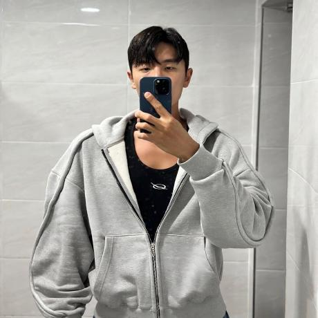
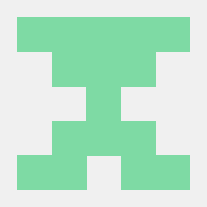
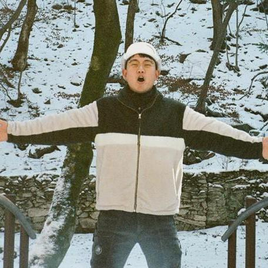

# LV.1 NLP 기초 프로젝트 : 문맥적 유사도 측정 (STS)

## 15조가십오조

|김진재 | 박규태 |윤선웅 |이정민 |임한택 |
|:-:|:-:|:-:|:-:|:-:|
|</img>|</img>|</img>|</img>|</img>|

  
## 역할 분담

|팀원| 역할 |
|:---:| --- |
| 김진재 |  |
| 박규태 |  |
| 윤선웅 |  |
| 이정민 |  |
| 임한택 |  |

